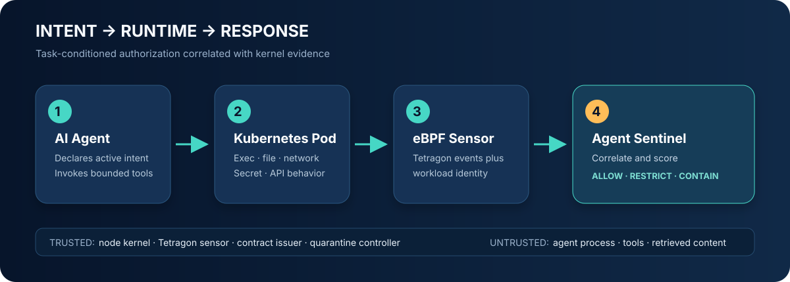

<div align="center">

# Agent Sentinel

### Intent-aware runtime detection and adaptive containment for AI agents on Kubernetes

[](https://github.com/shivam2003-dev/agent-sentinel-ebpf/actions/workflows/ci.yml)
[](LICENSE)
[](docs/roadmap.md)

**AI agents declare an intended action. Agent Sentinel checks what their containers actually do.**

</div>



## Why this project exists

Tool-using AI agents can be redirected by prompt injection, compromised dependencies, malicious
tool output, or stolen credentials. Application-layer policy can inspect a proposed tool call, but
it does not prove that the resulting process stayed within that action's boundary.

Agent Sentinel explores a second control plane: task-conditioned behavioral contracts correlated
with Kubernetes-aware eBPF telemetry. It evaluates process execution, sensitive file access,
network connections, and Kubernetes API operations, then produces graduated responses from
observation through Pod network quarantine.

The research question is deliberately narrow:

> Can high-level action authorization plus eBPF runtime evidence detect and contain compromised
> AI-agent behavior more accurately than static runtime rules, without breaking legitimate tasks?

## What is implemented

Version `0.1.0` is an executable research MVP, not a production security product.

- A validated `AgentBehaviorContract` format with per-intent process, file, network, and Kubernetes
  API permissions.
- A hybrid detector combining hard invariants with intent-conditioned deviation checks.
- A decaying per-Pod risk ledger with `allow`, `restrict`, and `contain` decisions.
- Parsers for normalized JSONL and core Tetragon `process_exec`, `process_connect`, LSM, and kprobe
  event shapes.
- A safe-by-default Kubernetes responder that emits quarantine commands and applies them only with
  the explicit `--apply-response` flag.
- A deny-all NetworkPolicy activated by a quarantine label, scoped patch-only RBAC, hardened demo
  agent, and Tetragon observation and opt-in enforcement policies.
- Replayable normal and compromised traces, automated tests, CI, research documentation, and a
  rendered white paper.

See [current limitations](docs/architecture.md#prototype-boundaries) before interpreting results.

## Five-minute local demo

Requirements: Python 3.10 or newer.

```bash
python3 -m venv .venv
source .venv/bin/activate
python -m pip install -e '.[dev,pdf]'

agent-sentinel validate-contract examples/contracts/research-agent.yaml
agent-sentinel evaluate \
  --contract examples/contracts/research-agent.yaml \
  --events examples/events/normal.jsonl \
  --response-plan

agent-sentinel evaluate \
  --contract examples/contracts/research-agent.yaml \
  --events examples/events/compromised.jsonl \
  --response-plan
```

Expected attack replay excerpt:

```text
CONTAIN  risk=100 workload=agent-lab/research-agent-compromised HARD_DENY_FILE
  - critical HARD_DENY_FILE: sensitive path is explicitly denied: .../serviceaccount/token
  response: kubectl label pod research-agent-compromised --namespace agent-lab \
    sentinel.shivam.dev/state=quarantined --overwrite
```

The demo only prints the response. It does not modify a cluster.

## Kubernetes and eBPF lab

The lab expects a Linux Kubernetes node with Tetragon installed and a CNI that enforces
`NetworkPolicy`. macOS can drive the cluster, but eBPF executes inside the Linux VM or nodes.

```bash
# Install Tetragon using its maintained Helm chart.
helm repo add cilium https://helm.cilium.io
helm repo update
helm install tetragon cilium/tetragon --namespace kube-system

# Install observation policy first. It does not deny file access.
kubectl apply -f policies/tetragon/observe-sensitive-files.yaml

# Build/load the Agent Sentinel image, then deploy the lab resources.
kubectl apply -k deploy/kubernetes
```

Do not apply `enforce-sensitive-files.yaml` until the kernel supports BPF LSM and the policy has
been exercised in monitor mode. The deployment and rollback procedure is documented in
[docs/deployment.md](docs/deployment.md).

## Contract example

```yaml
apiVersion: sentinel.shivam.dev/v1alpha1
kind: AgentBehaviorContract
metadata:
  name: research-agent
spec:
  selector:
    namespace: agent-lab
    podPattern: research-agent-*
  hardDeny:
    executables: [/bin/bash, /usr/bin/nsenter]
    files: [/var/run/secrets/kubernetes.io/serviceaccount/**]
  intents:
    - id: literature-review
      allow:
        executables: [/usr/local/bin/python*]
        files: [/workspace/**]
        network:
          - hostSuffix: arxiv.org
            ports: [443]
        kubernetesOperations: []
```

In the MVP, the active intent is attached through the Pod label
`sentinel.shivam.dev/intent`. A production design should replace that static label with signed,
short-lived action leases issued at tool boundaries.

## Repository map

| Path | Purpose |
|---|---|
| `src/agent_sentinel/` | Detector, contract model, Tetragon adapter, and Kubernetes responder |
| `examples/` | Behavioral contract and replayable normal/attack event streams |
| `policies/tetragon/` | Monitor-first eBPF observation and opt-in file denial policies |
| `deploy/kubernetes/` | Kustomize lab deployment and quarantine controls |
| `docs/whitepaper.md` | Source white paper with research questions and references |
| `output/pdf/` | Rendered, visually verified white paper |
| `tests/` | Unit, adapter, decision, and containment-plan tests |

## Research package

- [White paper](docs/whitepaper.md) and [PDF edition](output/pdf/agent-sentinel-whitepaper.pdf)
- [Architecture and trust boundaries](docs/architecture.md)
- [Threat model](docs/threat-model.md)
- [Research landscape](docs/research-landscape.md)
- [Experimental methodology](docs/research-methodology.md)
- [Roadmap](docs/roadmap.md)

## Safety and research integrity

All bundled IP addresses are documentation ranges, all attack traces are synthetic, and automatic
Pod deletion is intentionally absent. Results in the white paper are hypotheses and proposed
measurements unless explicitly identified as test output from this repository. See
[SECURITY.md](SECURITY.md) for responsible disclosure and trust assumptions.

## License and citation

Apache License 2.0. Cite the software using [CITATION.cff](CITATION.cff).
